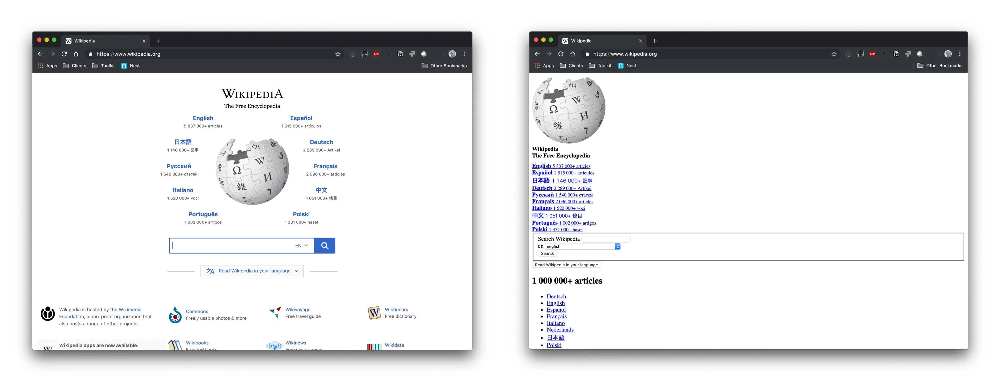

## What exactly is CSS?
___

**CSS (Cascading Style Sheets)** is a language used to control how HTML elements are displayed on a webpage.

⚠️ It is *not* a programming language, but a **style sheet language** that allows us to change how our website looks — including fonts, colours, positioning of elements, and much more!

There are a few different ways to use CSS in an HTML page:

- **Inline CSS**  
- **Internal style sheet**  
- **External CSS file**

To illustrate how important CSS is to websites, take a look at Wikipedia with/without CSS...

Which side do you prefer?