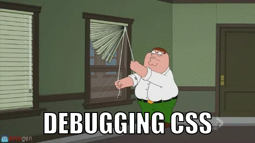

## Internal Style Sheets
___
Internal Style Sheets refers to the use of CSS within the HTML page with the `<style>` tag. 

We add a `<style>` block to our HTML, which is used to contain the CSS code which changes how our HTML looks. 

The styles you write inside the `<style>` tag only affect this one HTML page. This means the style changes won’t apply to other pages unless you add the same styles there too.


This way it can only be used within the HTML file and cannot be reused in other HTML pages.

Example:
```html
<head>
    <style>
        p {
            font-size: 30px;
        }
    </style>
</head>

<body>
    <p>This paragraph is styled using an internal style sheet.</p>
    <p>All paragraphs on this page will appear with a font size of 30 pixels.</p>
</body>
```



### Mess Around With these CSS Tags!

Try changing the values or adding new CSS rules inside the `<style>` block to see how your page changes. Here are some simple CSS examples you can try:

```css
p {
    font-size: 20px;       
    color: red;          
    background-color: yellow; 
    text-align: center;  
    font-weight: bold;    
    border: 2px solid black;
}
```

Change the numbers and colours and refresh your page to see what happens.