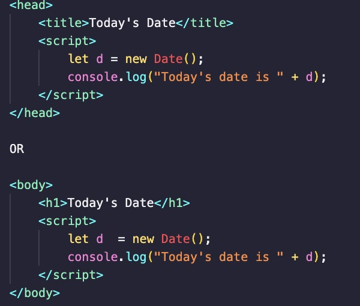
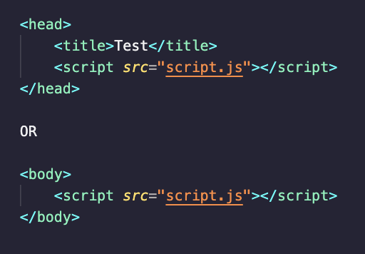

## Why do we need JS with HTML?

In order to make our websites more functional and reactive, we can incorporate JavaScript functionality into them. This lets us do loads of cool things, like change text on the page, send alerts to the user or even add interactive elements with proper functionality.

## How to add JavaScript to HTML?

There are 2 ways to add JavaScript to your website:

- **In the HTML File:** If you are using minimal JavaScript, you can place it inside your HTML file; either between the head tags, or right before the closing body tag.

- **In an external file:** If you are using a large amount of code, or want to keep your HTML file neat, you can create an external JavaScript file.

